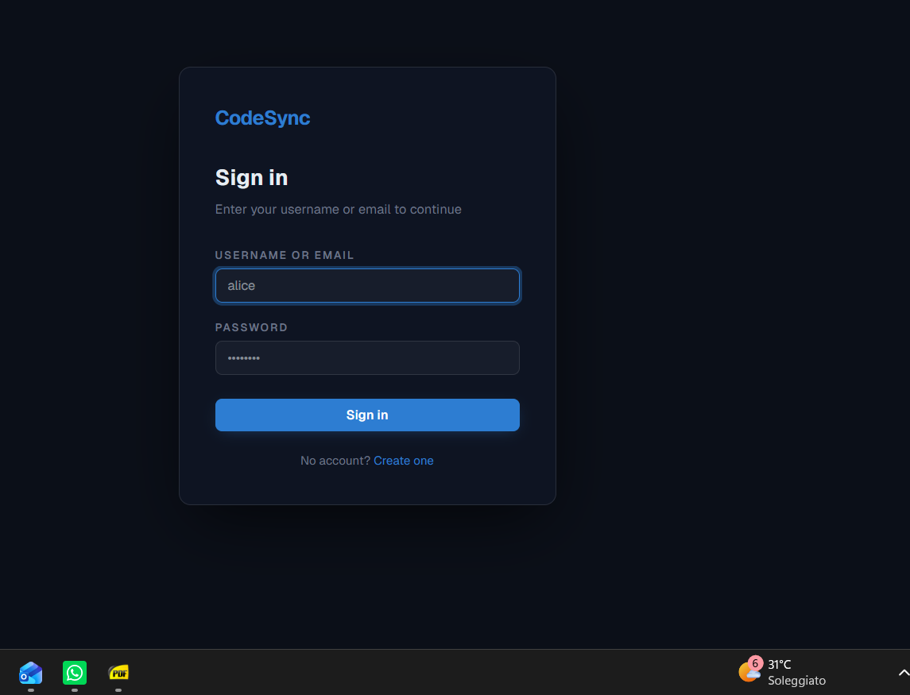
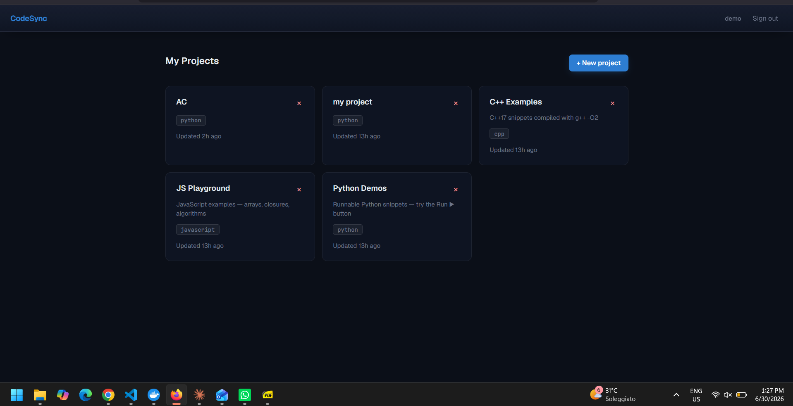
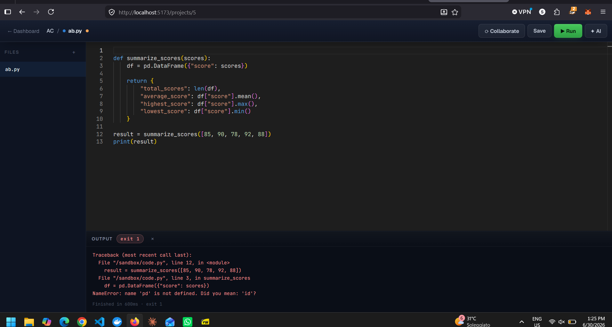

# CodeSync — Real-Time Collaborative Code Platform with Local AI Pair-Programmer

> A browser-based IDE where multiple users edit, run, and debug code together in real time, with a self-hosted **Qwen2.5-Coder** assistant that reviews, explains, and fixes code inline. **No paid APIs** — all AI runs locally via Ollama.

**Status:** ✅ All 7 build phases complete. This README is both the project documentation and the run guide.

---

## Screenshots

| Login | Dashboard |
|-------|-----------|
|  |  |


*Editor with sandboxed code execution, real-time collaboration, and AI panel*

---

## Table of Contents
1. [What This Is](#what-this-is)
2. [Tech Stack](#tech-stack)
3. [Architecture](#architecture)
4. [Repository Layout](#repository-layout)
5. [Prerequisites](#prerequisites)
6. [Run It (3 Steps + Start)](#run-it-3-steps--start)
7. [Windows: Docker Socket Fix](#windows-docker-socket-fix)
8. [Service Ports](#service-ports)
9. [Per-Service Dev Setup](#per-service-dev-setup)
10. [Environment Variables](#environment-variables)
11. [Security Model](#security-model)
12. [Verification Checklist](#verification-checklist)
13. [Troubleshooting](#troubleshooting)
14. [Instructions for Claude Code](#instructions-for-claude-code)

---

## What This Is

CodeSync is a polyglot, microservice-based collaborative coding platform demonstrating:

- **Systems programming** — a sandboxed C++ execution engine that runs untrusted code safely
- **Distributed real-time architecture** — CRDT-based (Yjs) conflict-free collaborative editing
- **Polyglot microservices** — Java, Node, Python, PHP, and C++ services working together
- **Applied AI** — a local Qwen2.5-Coder model for code review, explanation, and autofix

Everything is free and self-hosted. The only model provider is **Ollama** running on your own machine.

---

## Tech Stack

| Layer | Technology |
|-------|-----------|
| Frontend | TypeScript + React + Vite, Monaco Editor, plain CSS |
| Collaboration server | Node + TypeScript, `ws`, Yjs (CRDT) |
| Core API | Java 21 + Spring Boot (auth, projects, sessions, persistence) |
| AI service | Python + FastAPI → Ollama |
| AI models | `qwen2.5-coder:7b` (review/explain/fix), `qwen2.5-coder:1.5b` (autocomplete) |
| Execution engine | C++ runner, isolated via Docker |
| Admin panel | PHP (read-only analytics) |
| Data | PostgreSQL + Redis (pub/sub) |
| Orchestration | docker-compose |

---

## Architecture

```
                          ┌──────────────────┐
                          │  React (TS) SPA  │
                          │  Monaco + AI UI  │
                          └────────┬─────────┘
                                   │
         ┌─────────────────────────┼─────────────────────────┐
         │                         │                         │
         ▼                         ▼                         ▼
┌─────────────────┐      ┌──────────────────┐      ┌──────────────────┐
│ Spring Boot API │      │ Node WS Server   │      │ FastAPI AI Svc   │
│ auth / projects │      │ Yjs CRDT sync    │      │ review / explain │
│ sessions / exec │      │ presence/cursors │      │ fix / autocomplete│
└───┬─────────┬───┘      └────────┬─────────┘      └────────┬─────────┘
    │         │                   │                         │
    ▼         ▼                   ▼                         ▼
┌────────┐ ┌──────┐          ┌──────┐               ┌──────────────┐
│Postgres│ │Redis │◄─────────┤Redis │               │   Ollama     │
└────────┘ └──────┘          └──────┘               │ qwen2.5-coder│
    ▲                                                └──────────────┘
    │ spawns runner container per execution
    ▼
┌──────────────────────────┐        ┌──────────────────┐
│  C++ Runner (Docker)     │        │  PHP Admin Panel │
│  --network none          │        │  read-only stats │
│  mem/cpu limits, RO FS   │        └────────┬─────────┘
└──────────────────────────┘                 │
                                              ▼
                                         ┌────────┐
                                         │Postgres│
                                         └────────┘
```

---

## Repository Layout

```
codesync/
├── README.md                 # this file
├── docker-compose.yml        # brings up the whole stack (--profile app)
├── .env.example              # template — copy to .env
├── infra/
│   ├── postgres/             # init SQL
│   └── ollama/               # model pull helper
├── scripts/
│   └── seed.py               # demo user + sample projects
├── frontend/                 # React + TypeScript + Vite        (Dockerfile)
├── collab-server/            # Node + TS + Yjs WebSocket server (Dockerfile)
├── api/                      # Java 21 + Spring Boot            (Dockerfile)
│   └── src/.../db/migration/ # Flyway migrations
├── ai-service/               # Python + FastAPI                 (Dockerfile)
├── runner/                   # C++ execution engine            (Dockerfile)
└── admin/                    # PHP analytics panel             (Dockerfile)
```

All 6 Dockerfiles, all service source, `docker-compose.yml`, `.env.example`, Flyway migrations, and `scripts/seed.py` are present.

---

## Prerequisites

- **Docker Desktop** (WSL2 backend on Windows) + docker-compose — **required**, the sandbox depends on it
- **Ollama** — https://ollama.com — running on the host with both models pulled
- For local (non-Docker) dev only: Node 20+, Java 21 + Maven, Python 3.11+, PHP 8.2+, g++/CMake

Recommended hardware: 16 GB RAM minimum for the 7B model.

---

## Run It (3 Steps + Start)

From the project root (e.g. `C:\MY_Projects\codesync`):

### 1. Create your `.env`

**PowerShell:**
```powershell
cp .env.example .env
```
**cmd.exe:**
```cmd
copy .env.example .env
```
Then open `.env` and change **`JWT_SECRET`** (long, random) and **`ADMIN_PASS`**. Confirm `OLLAMA_URL=http://host.docker.internal:11434`.

### 2. Build the runner image (manual — not part of compose)

```bash
docker build -t codesync-runner runner/
```
This must succeed before any code execution works in the app.

### 3. Make sure Ollama is running with both models

```bash
ollama pull qwen2.5-coder:7b
ollama pull qwen2.5-coder:1.5b
ollama list      # confirm both appear
```

### Start everything

```bash
docker compose --profile app up --build
```

### Optional — load demo data (after the stack is up)

```bash
python3 scripts/seed.py
```

Then open:
- **App:** http://localhost:5173
- **API:** http://localhost:8080
- **Admin:** http://localhost:8000

---

## Windows: Docker Socket Fix

The Spring Boot **api** service spawns runner containers by talking to the Docker daemon via the mounted socket `/var/run/docker.sock`.

**Try the default first.** With Docker Desktop's WSL2 backend, the socket mount works because Compose runs inside the WSL2 VM where that socket exists.

**If the `api` container errors** with "cannot connect to the Docker daemon" or a permissions error, switch the Java Docker client to TCP:

1. Docker Desktop → **Settings → General** → enable **"Expose daemon on tcp://localhost:2375 without TLS"**.
2. In `.env`, set:
   ```
   DOCKER_HOST=tcp://host.docker.internal:2375
   ```
3. Restart the stack: `docker compose --profile app up --build`.

> Exposing the daemon on TCP without TLS is fine for local dev only. Don't do it on a shared or public machine.

---

## Service Ports

| Service | Port |
|---------|------|
| Frontend (Vite) | 5173 |
| Core API (Spring Boot) | 8080 |
| AI service (FastAPI) | 8001 |
| Admin panel (PHP) | 8000 |
| Collab server (WS) | 1234 |
| PostgreSQL | 5432 |
| Redis | 6379 |
| Ollama (host) | 11434 |

Change in `.env` / compose if any are occupied.

---

## Per-Service Dev Setup

Each service runs independently for development.

```bash
# Frontend
cd frontend && npm install && npm run dev          # http://localhost:5173

# Collaboration server
cd collab-server && npm install && npm run dev     # ws://localhost:1234

# Core API
cd api && ./mvnw spring-boot:run                    # http://localhost:8080

# AI service
cd ai-service && pip install -r requirements.txt && uvicorn app.main:app --reload --port 8001

# Runner image
cd runner && docker build -t codesync-runner .

# Admin panel
cd admin && php -S localhost:8000 -t public
```

---

## Environment Variables

Copy `.env.example` to `.env` and fill in:

```
# Postgres
POSTGRES_USER=codesync
POSTGRES_PASSWORD=change_me
POSTGRES_DB=codesync

# API
JWT_SECRET=change_me_to_a_long_random_string
DATABASE_URL=jdbc:postgresql://postgres:5432/codesync
DOCKER_HOST=                       # leave blank to use socket; set tcp://host.docker.internal:2375 on Windows if needed

# Redis
REDIS_URL=redis://redis:6379

# AI service
OLLAMA_URL=http://host.docker.internal:11434
AI_MODEL_HEAVY=qwen2.5-coder:7b
AI_MODEL_LIGHT=qwen2.5-coder:1.5b

# Runner
RUNNER_IMAGE=codesync-runner
RUNNER_TIMEOUT_SECONDS=10
RUNNER_MEMORY=256m
RUNNER_CPUS=0.5

# Admin
ADMIN_USER=admin
ADMIN_PASS=change_me
```

> **Never commit `.env`.** Only `.env.example` is tracked.

---

## Security Model

The execution engine treats **all** user code as hostile. Every run happens in a fresh Docker container with:

- `--network none` — no network access
- `--memory=256m` and `--cpus=0.5` — resource caps
- read-only root filesystem, writable scratch dir only
- non-root user inside the container
- `setrlimit` caps on process count, file size, and output
- a hard wall-clock timeout that kills runaway processes (e.g. infinite loops)
- container destroyed after each run

There is no trusted code. Never bypass the container.

---

## Verification Checklist

| Area | How to verify |
|------|--------------|
| Infra up | `docker compose --profile app up` starts all services with no errors |
| Auth/API | register → login (JWT) → create project → list projects |
| Frontend | log in, create a project, edit and save a file in the UI |
| AI | select code → **Explain** returns a real Qwen response |
| Sandbox | hello-world runs; an infinite loop is killed by the timeout |
| Collaboration | two browser tabs editing the same file sync live |
| Admin | panel loads and shows seeded analytics |
| End to end | fresh `docker compose --profile app up` boots the whole app |

---

## Troubleshooting

**`.env` missing / compose won't start** — you only have `.env.example`. Copy it to `.env` (Step 1) and fill in secrets.

**`api` can't reach the Docker daemon (Windows)** — apply the [Windows Docker Socket Fix](#windows-docker-socket-fix).

**Ollama unreachable from containers** — use `http://host.docker.internal:11434` as `OLLAMA_URL`. On Linux, also add `extra_hosts: ["host.docker.internal:host-gateway"]` to the relevant compose services.

**AI requests fail but service is up** — Ollama isn't running or models aren't pulled. Run `ollama list` and confirm both models appear.

**7B model too slow** — set both `AI_MODEL_HEAVY` and `AI_MODEL_LIGHT` to `qwen2.5-coder:1.5b` for development, or run Ollama with a GPU.

**Code execution fails immediately** — the runner image wasn't built. Run `docker build -t codesync-runner runner/` (Step 2).

**Port conflicts** — see [Service Ports](#service-ports) and change occupied ones in `.env`/compose.

---

## License

MIT — yours to use, modify, and showcase.
